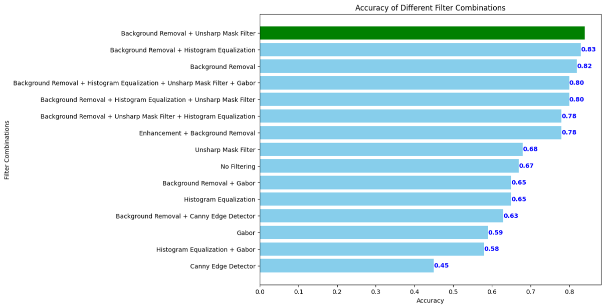
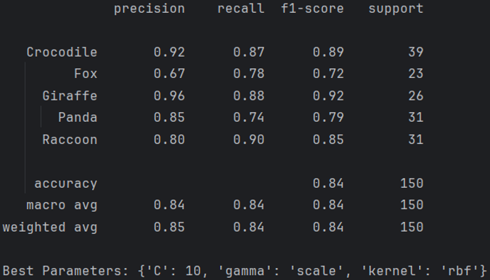
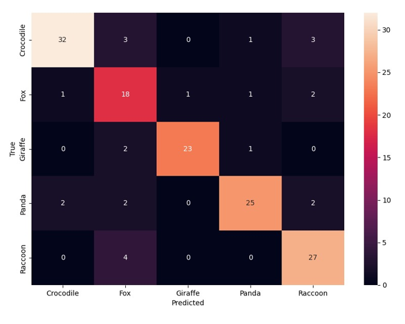

# Animal Image Classification Using BoVW Technique

This repository focuses on the classification of animal images by using the Bag-of-Visual-Words (BoVW) technique. The
project incorporates a multi-stage preprocessing pipeline, which includes image enhancement and application of various
filters. The BRISQUE algorithm is used to assess the quality of processed images.

## Table of Contents

- [Project Overview](#project-overview)
- [Enhancement](#enhancement)
- [Filtering](#filtering)
- [Ablation Study](#ablation-study)
- [Summarization + Classification](#summarization--classification)
- [Results](#results)
- [Summary/Conclusion](#summaryconclusion)
- [References](#references)
- [Contributors](#contributors)

## Project Overview

- **Objective:** Classify animal images using the BoVW technique.
- **Dataset:** The dataset comprises 500 images across five animal categories, with each category containing 100 images.
  The images are sourced from the “Animal Image Dataset (90 Different Animals)”[1] and “Animals Detection Images
  Dataset”[2].
- **Preprocessing:** Image enhancement for improved visualization, application of various filters to optimize
  classification accuracy.
- **Assessment:** Employ the [BRISQUE algorithm](https://github.com/rehanguha/brisque) to evaluate 50 random images for
  enhancement quality.

## Enhancement

- Images were first resized consistently, maintaining their aspect ratios, with the box technique ensuring minimal
  quality loss. Later enhancements included the unsharp masking, filters for sharpness and brightness improvement,
  and both gamma and sigmoid corrections to bolster visual clarity. The BRISQUE score quantified these enhancements,
  with a lower score indicating enhanced image quality.
    - 50 Random Images, 500px Min Size: Raw: 20.96, Resized: 26.33, Enhanced: 22.21
    - Full Dataset, 500px Min Size: Raw: 21.07, Resized: 25.65, Enhanced: 23.81
    - Full Dataset, 1000px Min Size: Raw: 21.07, Resized: 31.48, Enhanced: 26.74
- The filters employed are from the Pillow and OpenCV libraries.

## Filtering

- The filters employed are from OpenCV and Rembg library. To refine the dataset for optimal classification performance,
  multiple image filters and transformations were explored, aiming to accentuate key features and diminish noise or
  non-essential information. Among them, Rembg emerged as the main and most important, adept at meticulously erasing
  backgrounds and spotlighting the animals.[4]
- Our other filters included:
    - Histogram Equalization: Amplifying image contrast to unveil hidden features.
    - Gabor Filter: Accentuating animal textures and patterns for nuanced classification.
    - Canny Edge Detector: Outlining animal contours to underscore distinct shapes.
    - Unsharp Mask Filter: Sharpening images to make every detail count.

## Ablation Study

- 

## Summarization + Classification

- The Bag of Visual Words (BoVW) served as the main technique for classification, used in conjunction with the following
  tools:
    - Mini-Batch K-means (Scikit Learn library): Efficiently clusters results.
    - SIFT feature detection method (OpenCV library): Offers good results despite image transformations.
    - GridSearchCV and SVC classifier (Scikit Image library): Retrieve the best parameters for classifying the data.

## Results

- Classification results are presented through precision, recall, f1-score, and accuracy scores. The highest accuracy
  achieved was 0.84.
- 
- 

## Summary/Conclusion

- The resized dataset is effectively refined by using brightness and sharpness filters, an unsharp mask, and both gamma
  and sigmoid correction filters.
- An ablation study revealed that the use of Rembg and Unsharp Mask Filter, combined with tailored summarization and
  classification methods and optimized hyperparameters, yielded the highest classification accuracy among all tested
  filters.

## References

[1] S. Banerjee. "Animal Image Dataset (90 Different Animals)“.
Kaggle. https://www.kaggle.com/datasets/iamsouravbanerjee/animal-image-dataset-90-different-animals/data (accessed: Aug.
31, 2023).

[2] "Animals Detection Images Dataset“.
Kaggle. https://www.kaggle.com/datasets/antoreepjana/animals-detection-images-dataset?select=test (accessed: Sept. 2,
2023).

## Contributors

- Diego Gasparis ([@D-Gaspa](https://github.com/D-Gaspa))
- Mario Sánchez ([@MegaChestercat](https://github.com/MegaChestercat))