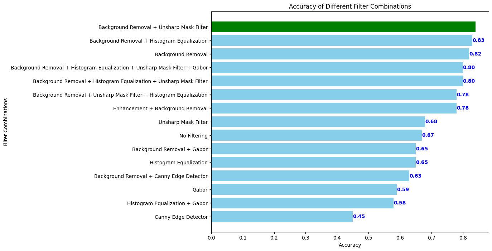

# Animal Image Classification Using BoVW Technique

This repository showcases a project focused on classifying animal images using the Bag-of-Visual-Words (BoVW) technique. It incorporates a multi-stage preprocessing pipeline for image enhancement and applies various filters. The processed images' quality is assessed using the BRISQUE algorithm.

## Table of Contents
- [Project Overview](#project-overview)
- [Results](#results)
- [Acknowledgements](#acknowledgements)
- [Contributors](#contributors)

## Project Overview

### Objective and Goals
Our aim was to explore image enhancement and classification techniques:
- Improving image quality through resizing and filtering to achieve better BRISQUE scores.
- Employing the BoVW technique to preprocess and summarize a dataset comprising 500 images across five animal categories: Crocodile, Fox, Giraffe, Panda, and Raccoon.

### Enhancement
Resizing images for uniformity, applying unsharp masking, and filters for sharpness and brightness improvement were key steps. Gamma and sigmoid corrections further bolstered visual clarity. The BRISQUE score provided a quantitative assessment of these enhancements.

### Filtering
We explored various filters including Rembg for background removal, and others like Histogram Equalization, Gabor Filter, Canny Edge Detector, and Unsharp Mask Filter for dataset refinement.

### Ablation Study and Classification
The ablation study tested the impact of different filter combinations on the classification accuracy. Below is a visual representation of the study's results:

This study provided insights into how each filtering technique influenced the model's performance, guiding us in optimizing the preprocessing pipeline.
For classification, SIFT was used for feature extraction, Mini-Batch K-Means for clustering, and BoVW for image representation. SVC, optimized via GridSearchCV, was our classifier of choice.

### Results
The project achieved an impressive 0.84 accuracy score, highlighting the effectiveness of our preprocessing and classification methods.

## Acknowledgements
This project was made possible by the following datasets:
- [Animal Image Dataset (90 Different Animals)](https://www.kaggle.com/datasets/iamsouravbanerjee/animal-image-dataset-90-different-animals) by S. Banerjee.
- [Animals Detection Images Dataset](https://www.kaggle.com/datasets/antoreepjana/animals-detection-images-dataset) from Kaggle.

We extend our gratitude to the dataset creators and Kaggle community for providing these invaluable resources.

## Contributors
- Diego Gasparis ([@D-Gaspa](https://github.com/D-Gaspa))
- Mario Sánchez ([@MegaChestercat](https://github.com/MegaChestercat))
